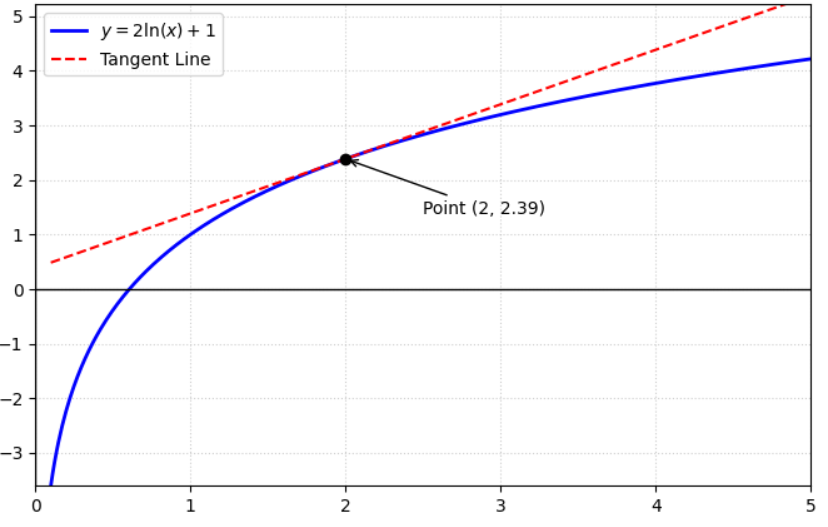

# Ableitung Und Differentiation
---

> Wie weiß man, wie sich eine Funktion an einem Punkt verändert?
> - Die Lösung ist die Steigung der Tangente.

> Aber wie berechnet man die Steigung an einem einzigen Punkt?
> - Wir nehmen zwei Punkte und berechnen die Steigung der Sekante.
> - Dann lassen wir h → 0 (Limit), sodass die Sekante zur Tangente wird.
> - Das Ergebnis ist die Ableitung f′(x).

---
## 1. Definition und Formel
**Definition:** Die Ableitung $f'(x)$ gibt die *momentane Änderungsrate* (Steigung) einer Funktion an einer Stelle $x$ an.

**Formel:** 
*1. Differentialquotient*

$$f'(x) = \lim_{h \to 0} \frac{f(x+h) - f(x)}{h}$$

*2. lineare Funktion*

- $f(x) = mx + b \implies f'(x) = m$

*3. Trigonometrische Funktionen*

- $(\sin x)' = \cos x$
- $(\cos x)' = -\sin x$

*4. Exponentialfunktion*

- $(e^x)' = e^x$

*5. Die Konstanten*

- $f(c) = c \implies f'(x) = 0$

---

## Beispiel und Berechnung
